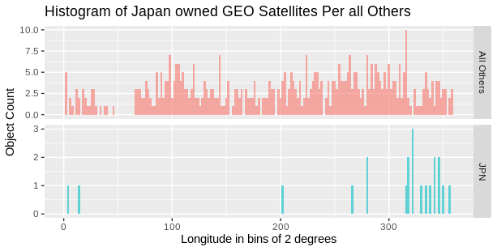
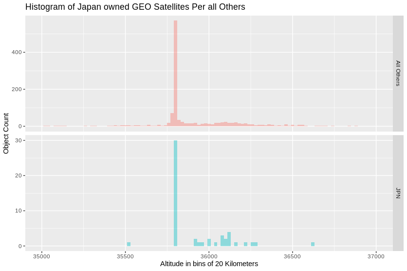

```{=html}
<!---
output: html_document
editor_options: 
  chunk_output_type: console
--->
```
```{=html}
<!---  
Barry von Tobel
RMarkdown file 
https://rmarkdown.rstudio.com/lesson-7.html - tables
https://www.r-bloggers.com/2020/02/getting-started-in-r-markdown/
--->
```
```{r initial, echo=FALSE}
# Setting the working directory
# or else comment out the setwd and set it by selecting 'session/'set working directory'
setwd("/home/bvt/Dropbox/eng_science/R/wd/tle/cdm")
# https://www.space-track.org/basicspacedata/query/class/cdm_public/orderby/CDM_ID asc/format/csv/emptyresult/show
# https://www.space-track.org/basicspacedata/query/class/gp/EPOCH/%3Enow-30/orderby/NORAD_CAT_ID,EPOCH/format/csv
# https://www.guru99.com/r-for-loop.html
# https://www.r-bloggers.com/2015/08/how-to-use-lists-in-r/
###-----------###
#options(scipen=999) # this option supposedly prevents real numbers from displaying scientific notation
#Load required packages
shh <- suppressPackageStartupMessages # It's a library
shh(library(ggplot2))
shh(library(dplyr)) # part of the tidyverse modules
shh(library(knitr))
shh(library(DT))
# constants
file_date <- "07Jan21" 
#file_date <- "08Dec21" 

#use this format to the two CSV files downloaded from space-track
G <- 6.67408E-11
M <- 5.972E24
EarthRadius <- 6.371E6 # in meters, this is the mean radius
EarthVolume <- (EarthRadius^3 * 4 * pi)/3 # in meters^3
```

<!---  Intro comment --->

# Introduction

Data dated `r file_date`

This analysis downloads from space-track the latest gp and cdm file sets using manually changed file date, which for this document is `r file_date`. This document is produced using the RMarkdown syntax that comes bundled with RStudio, an open-source R Integrated Development Environment. The R code for the analysis is embedded in the document, but the 'ECHO' is set to false so the code and code comments are not displayed on the page. A nice feature of RMarkdown and most other types of Web document tools is that the pagination isn't enforced, so the document becomes one continuous page, a nice feature when the document has images, graphs, and tables. An future enhanced document can have the index of the heading on the left, which aids in navigation.

<!---  Setup Chunk --->

```{r setup, echo=FALSE, warning=FALSE}
# read the two csv files that are manually downloaded from space-track
# https://www.space-track.org/basicspacedata/query/class/cdm_public/orderby/CDM_ID asc/format/csv/emptyresult/show
# https://www.space-track.org/basicspacedata/query/class/gp/orderby/CCSDS_OMM_VERS asc/format/csv/emptyresult/show
cdm_public <- read.csv(paste("cdm_public.",file_date,".csv",sep = ""))
gp_catalog <- read.csv(paste("gp_catalog.",file_date,".csv",sep=""),fill = TRUE, na.strings = "NA")
# using the MEAN_MOTION from the gp, calculate the object altitude.  In orbital 
# mechanics, mean motion is the angular speed required for a body to complete 
# one orbit, assuming constant speed in a circular orbit which completes in the 
# same time as the variable speed, elliptical orbit of the actual body.Wikipedia
# gp_catalog$T_sec <- 86400/
gp_catalog$altitudex <- (((((1/gp_catalog$MEAN_MOTION*86400)^2/((2*pi))^2)
                          *G*M)^(1/3)-EarthRadius))/1000
gp_catalog$altitude <- (((((86400/gp_catalog$MEAN_MOTION)/(2*pi))^2 * G * M))^(1/3)-(EarthRadius))/1000
  
number <- count(gp_catalog) -1
# only show LEO Objects in new df - gp_leo, note the weird comma needed,
# believe i could of used DPLYR filter or select
gp_leo <- gp_catalog[gp_catalog$altitude < 2201,]
#gp_catalog$altitude <- as.numeric(gp_catalog$altitude)
hist <- hist(gp_leo$altitude, breaks = 200, plot = FALSE)
# calculate the volumes per bin, create a new dataframe, note that 'counts' 
# need to add 1
df_volume <- data.frame(breaks = c(hist[["breaks"]]), 
                        counts = c(hist[["counts"]],1),
                        mids = c(hist[["mids"]],1), 
                        altitude.density = c(hist[["density"]],1))
# now that we know the bin size, put that column into the df_leo
#gp_leo$bins <- cut(gp_leo$altitude, breaks = df_volume$breaks)
gp_leo$bins <- cut(gp_leo$altitude, breaks = (df_volume$breaks), dig.lab = 4)

# Remove the selected columns, the data frame can have only specified files
gp_leo <- subset(gp_leo, select = c(OBJECT_ID, OBJECT_NAME, NORAD_CAT_ID, OBJECT_TYPE, altitude, bins))
# calculate the hollow sphere of each histogram bin
# https://www.engineersedge.com/volume_calc/hollow_sphere.htm
for(i in 2:nrow(df_volume))
{
df_volume$volume[i] <- 4.1888*((df_volume$breaks[i]^3) - df_volume$breaks[i-1]^3)
}
# Calculate and add $vol_density, object count per volume, per cubic kilometer
df_volume$vol.density <- df_volume$counts / df_volume$volume
# vary the xlim for LEO to GEO or all
```
---------------------------
Total Catalog Count for `r file_date` is `r count(gp_catalog)`

# LEO Statistics

This graph depicts all the cataloged items in the space-track download. It is factored into the 4 categories used by space.track, Payload, Debris, Rocket Body, and TBA.

<!---  LEO Count Histogram per altitude in bins into four factors --->

```{r ghist1, echo=FALSE, warning=FALSE}
ghist1 <- ggplot(gp_leo, aes(x=altitude, fill = OBJECT_TYPE)) +
  geom_histogram(binwidth = 10) +
  #geom_line(stat = "density") +
  labs(title="Histogram of Object types Per Band of Orbit",
       x = "Altitude in bins of 20 Kilometers",
       y = "Object Count") +
  xlim(100, 2200)
  # xlim(550, 570) - test, very odd, but the two bins ned to be xlim to be shown for the correct count of 803
ghist1
```

# Count Density

This second graph depicts all the cataloged items in the space-track same as the above histogram with showing normalized density as a line and the y axis. Normalized density in this context refers to the area under the density curve equal 1.

<!---  LEO Histogram without factor but has density for y --->

```{r ghist2, echo=FALSE, warning=FALSE}
 ghist2 <- ggplot(gp_leo, aes(x=altitude)) +
       geom_histogram(binwidth = 10, color="green", aes(y=..density..)) +
       geom_line(stat = "density") +
       labs(title="Histogram of Normalized Density of Satellites Per Band of Orbit",
            x = "Altitude in bins of 10 Kilometers",
            y = "Object Density") +
       xlim(100, 2200)
 ghist2
# debug line - summary(ghist2[["data"]][["bins"]])
# write.csv(as.data.frame(summary(ghist2[["data"]][["bins"]])), file = "summary.csv")
```

This is a table of all the LEO assets that are depicted in the histograms. <!---  Data table of the LEO Objects --->

```{r LEOTable, echo=FALSE, warning=FALSE}

datatable(gp_leo)
```

## Volume Density

Graph that portrays the density of objects per bin's Hollow Sphere area. The caculation is the number of objects within an orbital band, divided by the volume in cubic kilometers of the hollow sphere which will give objects per cubic kilometer.  This is assuming that we are dealing with perfect circles and circular orbits.


At band 550 to 560, the 734 objects has an average of 0.0000196643679 objects per cubic kilometer, or inversley one object per 50,853 cubic kilometers. the 550 to 560 band has about 37,326,397 cubic kilometers.   t. <!---  Graph that portrays the density of objects per bin's Hollow Sphere area --->

```{r vol_density, echo=FALSE, warning=FALSE}

gvol <- ggplot(df_volume, aes(x=mids, y=vol.density)) +
  #geom_histogram(binwidth = 20, color="green", aes(y=counts)) +
  geom_line(aes(x=mids, vol.density)) +
  #geom_line(stat = "density") +
  #geom_point(alpha=1/1) + 
  #geom_col(bins=10, color = 'blue', alpha=1/5) +
  #geom_smooth(color = 'red') +
labs(title="Object Density per volume of Band of Orbit",
     x = "Middle of Bin in Kilometers",
     y = "Object Count / Hollow Sphere Volume") +
  xlim(100, 2200)
gvol
```

# CDM Probability

This section merges the CDM file into the LEO catalog file. The CDM file, downloaded from space-track often has several entries for the same objects, often a message for object A proximity to Object B, and conversely Object B's proximity to Object A. These same objects are aggregated with each other and the PC (Probability) is averaged over the number of similar CDMs to what is called the 'Mean PC' The end result is that each bin in the histogram has a calculated Mean PC. A density line is calculated which will be used to perform a covariance analysis

<!---  CDM Probability --->

```{r CDM.probability, echo=FALSE, warning=FALSE}
# merge the catalog and cdm keying on the ,
# Average CDM Probability of Collision per cdm_pubic download
# to to caculate the mean of same objects but different ids
# https://stackoverflow.com/questions/11562656/calculate-the-mean-by-group
# form-split-apply-combine
# merge the two dataframes where SAT_1_ID maps to a NORAD_CAT_ID  that exists in the cdm_public
# leaving us only with leo objects with a cdm associated with it
df_merge.tmp <- merge(cdm_public, gp_leo, by.x = "SAT_1_ID", by.y = "NORAD_CAT_ID", all = TRUE)
#df_merge <- merge(gp_leo, cdm_public, by.x = "NORAD_CAT_ID", by.y = "SAT_1_ID", all.y = all)
df_merge <- aggregate(df_merge.tmp$PC, list(df_merge.tmp$altitude), mean)
colnames(df_merge) <- c("Altitude", "PC_mean")
df_pc_alt <- merge(df_merge, gp_leo, by.x = "Altitude", by.y = "altitude")

# hist_merge <- hist(df_merge$Bins, breaks = 200)
# this one for the presentation
ghist3 <- ggplot(df_merge, aes(x=Altitude)) +
  geom_histogram(binwidth = 10, color="green", aes(y=..density..)) +
  geom_line(stat = "density") +
  #geom_line(data=df_merge[y=df_merge$PC_mean!="NA", ]) +
  geom_point(aes(y=(PC_mean)), colour="blue") +
  #geom_line(stat = "density") +

  
  labs(title=" CSpOC CDM  Probability of LEO Collision Per Band of Orbit",
     x = "Altitude in bins of 10 Kilometers wide",
     y = "Mean PC ") +
  xlim(400, 1650)
ghist3
```

# Density Covariances

A covariance exists between the density line in the figure "Normalized Density of Satellites per Band of Orbit" and the density curve in the figure "CSpOC CDM Probability of LEO Collison per Band of Orbit". The hypothesis is that the number of satellites per band of orbit affects the Probability of Collision, PC. There may also be some variance with the figure "Object Density per Volume per Band of Orbit".

```{r density.covariance, echo=FALSE, messgae=FALSE, results = 'hide', warning=FALSE}
# use merge
df_pc_alt <- merge(df_merge, gp_leo, by.x = "Altitude", by.y = "altitude")
cov_pearson <- cov(df_pc_alt$Altitude, df_pc_alt$PC_mean, 
                   use = "pairwise.complete.obs", method = "pearson")
ov_kendall <- cov(df_pc_alt$Altitude, df_pc_alt$PC_mean, 
                   use = "complete.obs", method = "kendall")
ov_spearman <- cov(df_pc_alt$Altitude, df_pc_alt$PC_mean, 
                   use = "complete.obs", method = "spearman")
cb <- cbind(df_pc_alt$Altitude, df_pc_alt$PC_mean)
X <- cov(cb)
# ghist4 <- ggplot(rbind(
#               df_pc_alt(x=PC_mean, type="PC_mean"), 
#               df_pc_alt(x= altitude, type="altitude")),
#               aes(x=x, color=type))+
#   geom_density() +
#   geom_histogram(binwidth = 10, color="green", aes(y=..density..)) +
#   #geom_line(stat = "density") +
#   
#   #geom_line(data=df_merge[y=df_merge$PC_mean!="NA", ]) +
#   #geom_point(aes(y=(PC_mean)), colour="blue") +
#   #geom_line(stat = "density") +
# 
#   
#   labs(title="CDM & Altitude 'count'  Densities",
#      x = "Altitude in bins of 10 Kilometers wide",
#      y = "Mean PC ") +
#   xlim(400, 1650)

#ghist4


#create analysis dataframe with values from ggplots
# on ghist3, 1 is the historgram count per bin, 2 is the density curv, 3 is the CDM.
#ls_analysis <- ggplot_build(ghist3)
test1 <- layer_data(ghist3, 1) # green histogram
test2 <- layer_data(ghist3, 2) # count density
test3 <- layer_data(ghist3, 3) # blue CDM density
# df_analysis <- cut(test3$x, breaks = 126, dig.lab = 4)
# for(i in 2:nrow(df_volume))
# {
# df_volume$volume[i] <- 4.1888*((df_volume$breaks[i]^3) - df_volume$breaks[i-1]^3)
# }

#df_analysis$altitude.density = as.data.frame(c(hist[["density"]],1))
#df_analysis$CDM_PC <- as.data.frame(ghist3[["plot_env"]][["ghist3"]][["data"]][["PC mean"]])


```

# test area

Several images from previous projects. These are specific to Japanese assets but followong an 80/20 principle we can easly alther this for any county, company or other sortable object.





```{r test, echo=FALSE, warning=FALSE}
#
#merged.aor.1 <- merge(df.aor, df.country.list, by.x = "COUNTRY_CODE", by.y = "SpaDoc.Code", 
 #                     sort = F, all.x = T)
# reduce the number of columns by explicitly adding what columns you want
#merged.aor.select.1 <- merged.aor.1[ , #c("COUNTRY_CODE","English.ISO","OBJECT_ID","Alpha.3.Code","OBJECT_NAME",
  #                                       "INCLINATION", "PERIOD","SITE", "orbit","RA_OF_ASC_NODE")]

#write.csv(merged.aor.select.1, file = 'merged.geo.select.1.csv')
```
